## User Cases

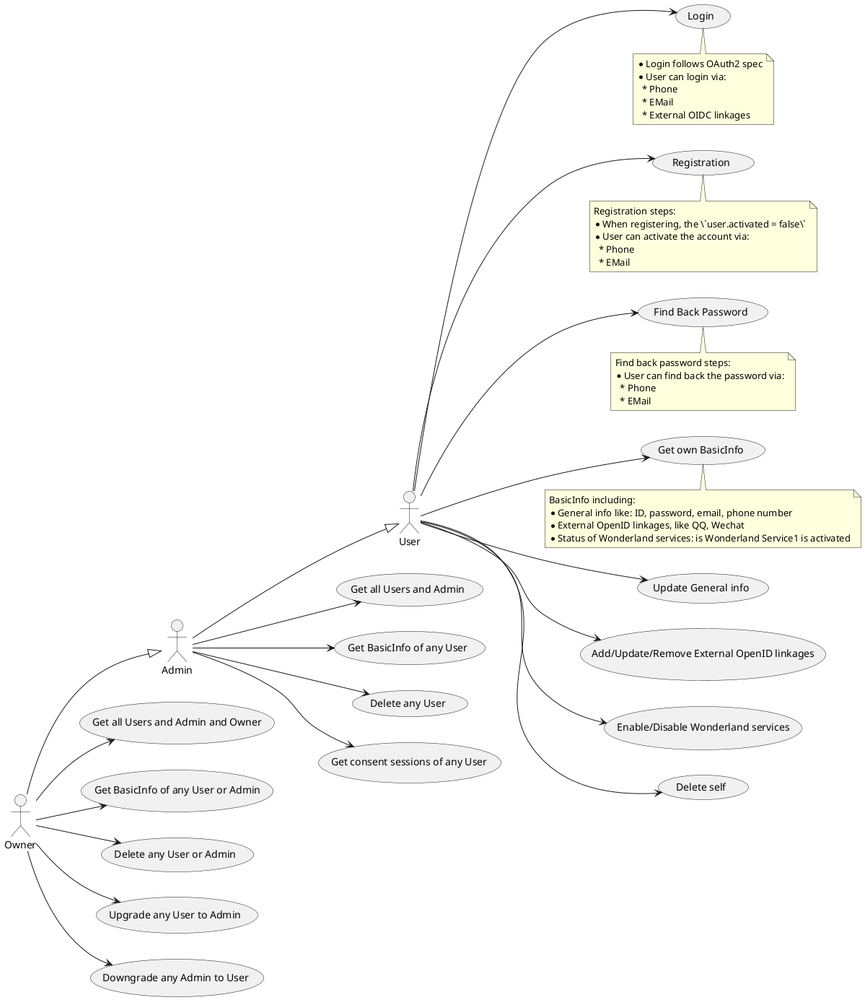

### User Login

User has multiple ways to login:
* Via identifiers/password:
  * Identifier contains: EMail, Phone Number
* Via Identifier specific ways:
  * Some identifiers have special ways to login. For example:
    * EMail: Server can send an email
    * Phone Number: Server can send a message
* Via social login

#### Via identifiers/password

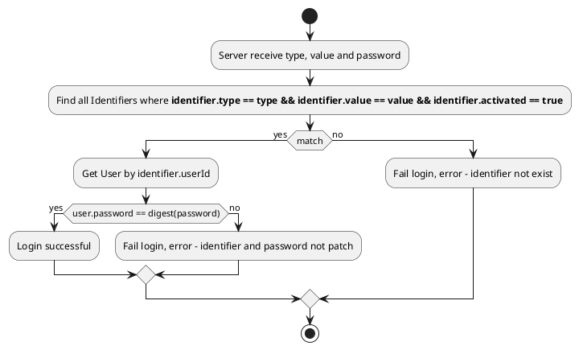

##### Sequence Diagram

See [Ory Hydra Login Flow](https://www.ory.sh/hydra/docs/concepts/login)

#### Via identifier specific way

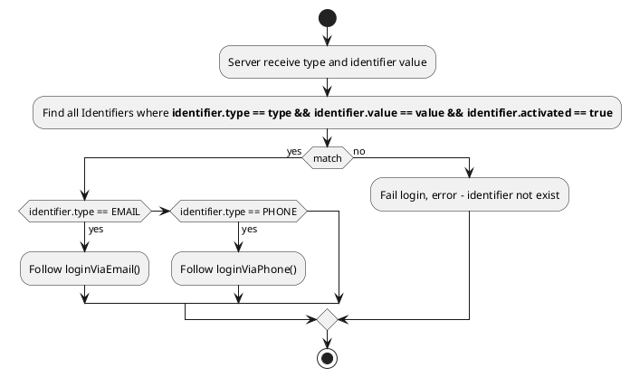

#### Via social login (Can be considered as some _identifier specific ways_)

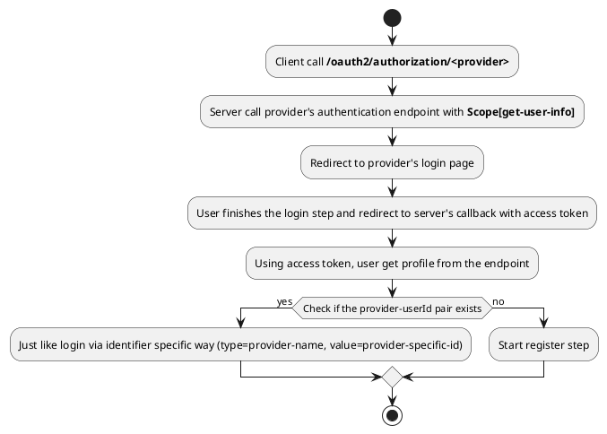

##### Sequence Diagram

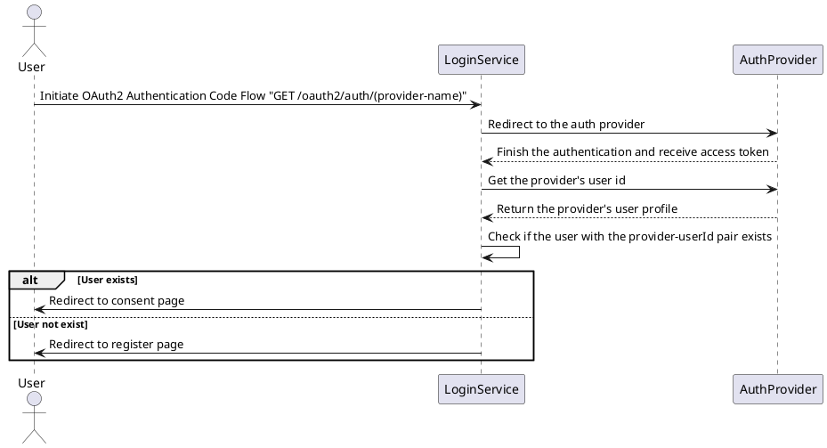

### User Registration

User can register via all identifier types. Each identifier type has specific ways to enable self.

#### Sequence Diagram

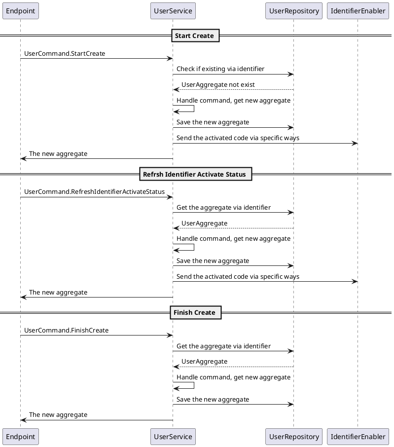

#### Action Diagram

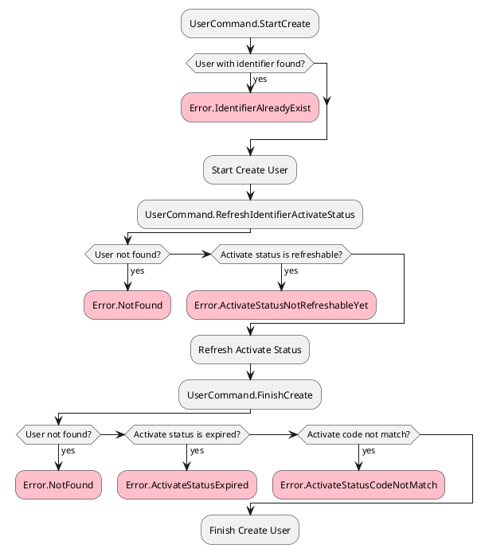

### User Update Info

User can update the user info to self or other users

#### Sequence Diagram

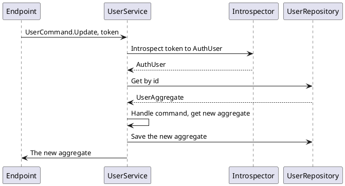

#### Action Diagram

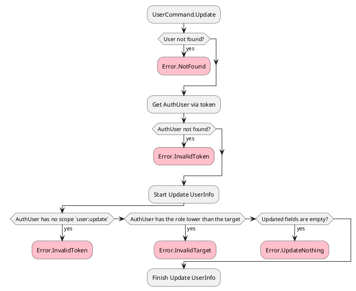

### User Change Password

User can change the password to self

#### Sequence Diagram

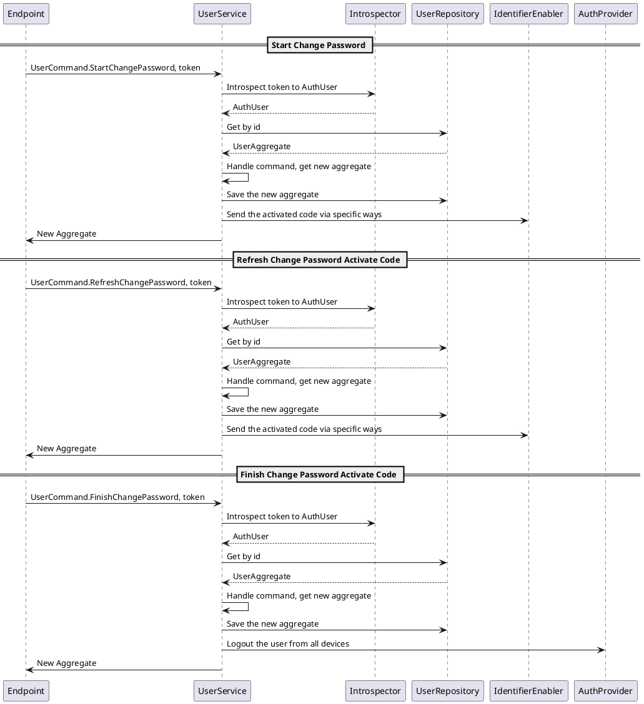

#### Action Diagram

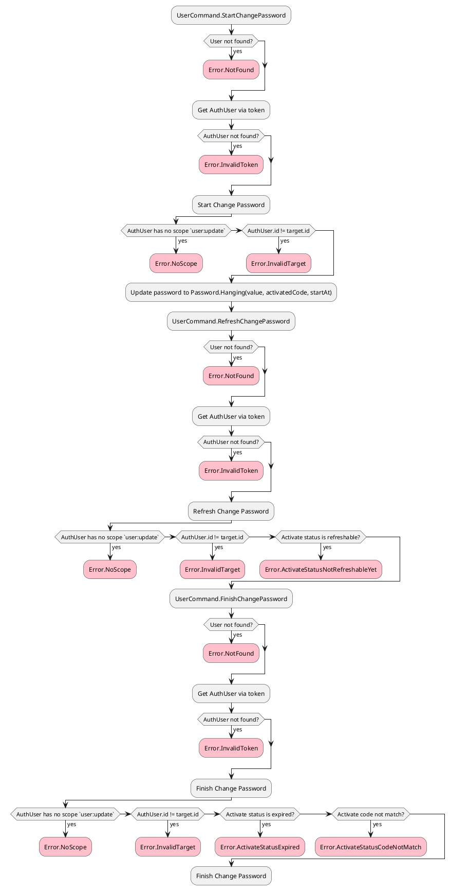

### User Super Update

Admin or higher can update any users strictly lower then self

#### Sequence Diagram

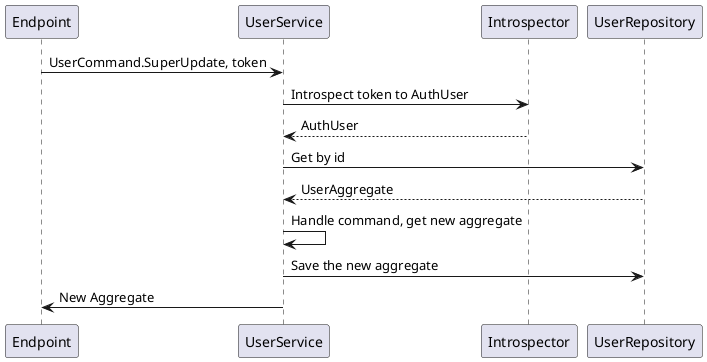

#### Actions Diagram

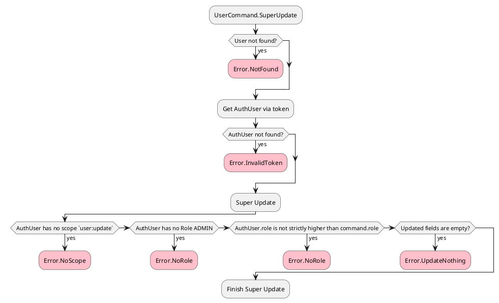

### User Enable Identifier

User can enable a new identifier

#### Sequence Diagram

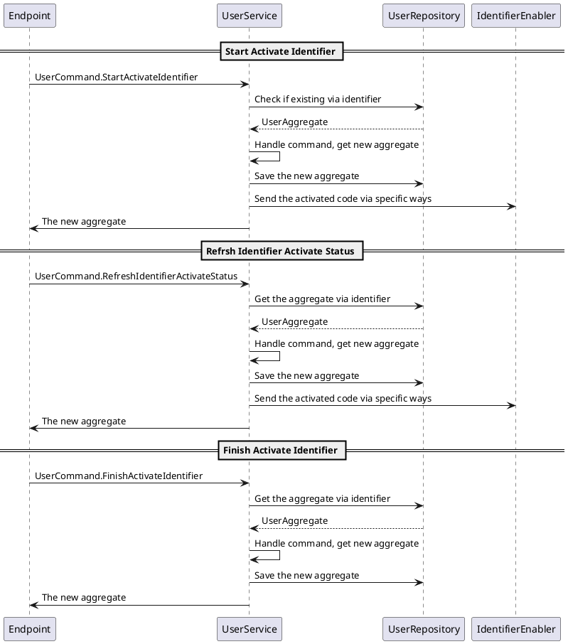

#### Action Diagram

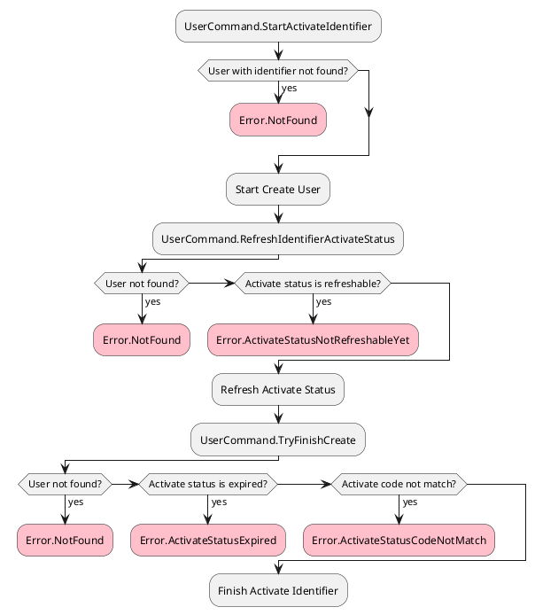

### User Delete

User can delete self. For admin or higher, he can delete users strictly lower then self

#### Sequence Diagram

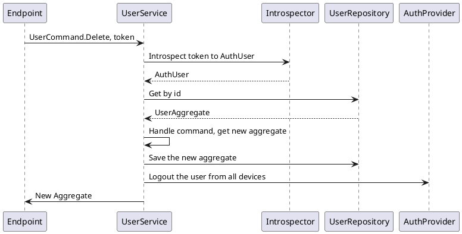

#### Actions Diagram

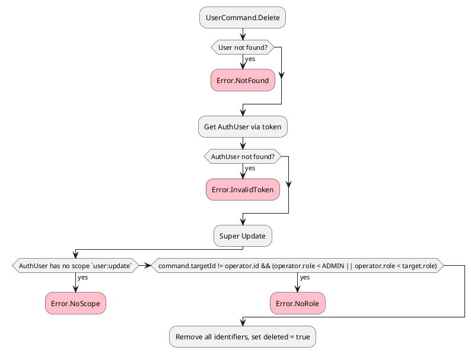

## API Interface

* GET /oauth2/auth: Start login via Ory Hydra
  * Map to `hydra:admin-port/auth2/auth`
* GET /oauth2/auth/(provider-name): Start login via OAuth2 providers
* GET /oauth2/auth/(provider-name)/callback: OAuth2 provider callback
* GET /oauth2/login: Prepare login page
* POST /oauth2/login: Check identifier and credentials
* GET /oauth2/consent: Prepare consent page
* POST /oauth2/consent: Check consent

## Class Diagrams

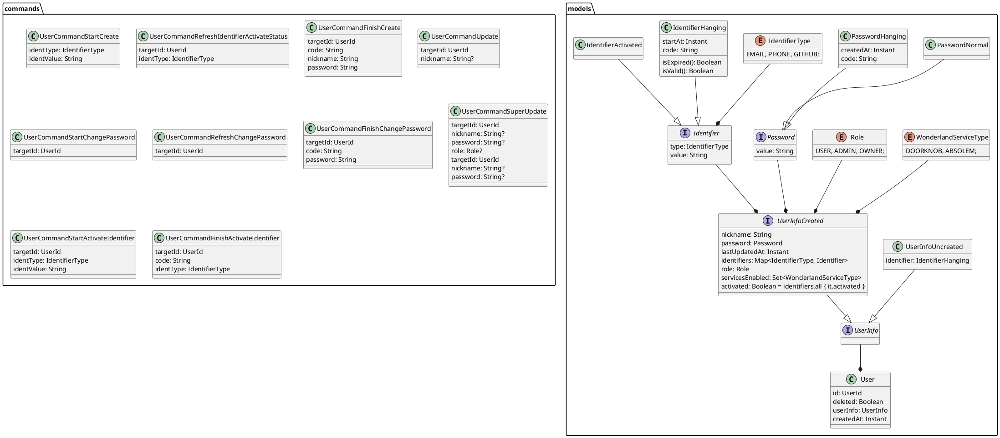

## References

* https://medium.com/javarevisited/jwt-and-social-authentication-using-spring-boot-90e4faaa9204
* https://github.com/callicoder/spring-boot-react-oauth2-social-login-demo
