## Login

### Main

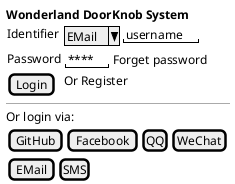

### Via Specific Ways

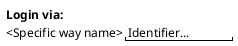

## Register

### Directly

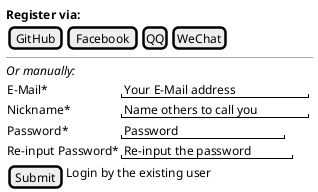

### Redirect from Social Ways

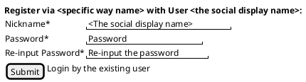

## Users

### Root

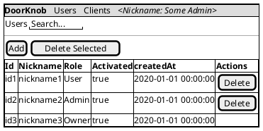

### Detail

#### Read

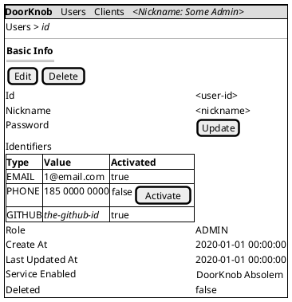

#### Edit

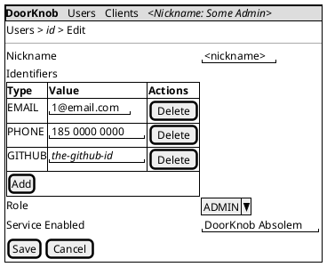

## Clients

### Root

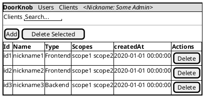

### Detail

#### Read

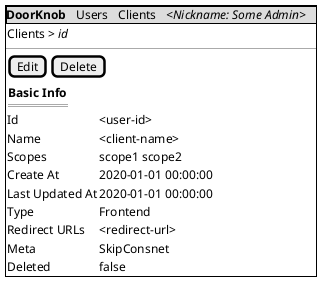

#### Edit

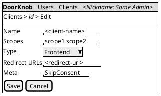

## \[Incubating] Services

### Root

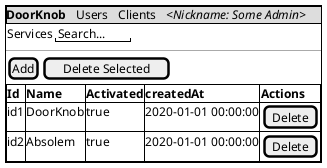
